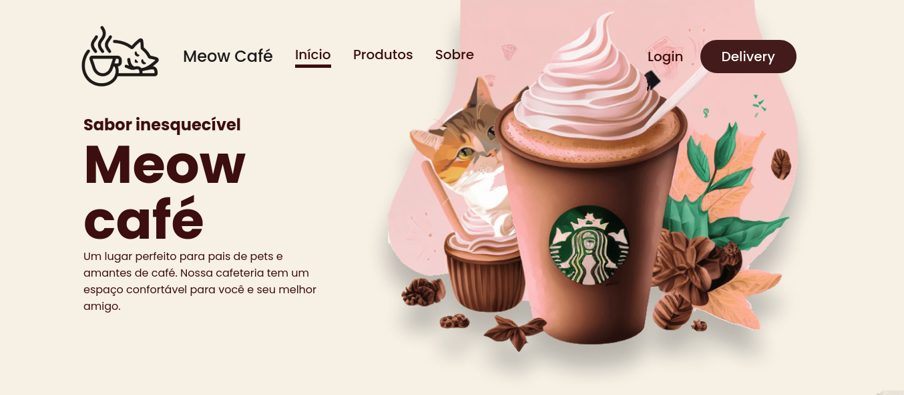

Esse foi um projeto proposto pela plataforma [Codante](https://codante.io), onde o objetivo era desenvolver uma landing page de uma empresa fictícia de café chamada Meow Café.

## 🔨 Requisitos

- A aplicação deverá ser responsiva. Considere **pelo menos** 2 tamanhos de tela (mobile e desktop).
- Transforme o design do Figma em um site funcional usando apenas HTML, JavaScript e CSS.
- O desafio principal é fazer a página sem o uso de frameworks ou bibliotecas, mas fica ao seu critério caso você queira utilizar alguma ferramenta que você está estudando (verifique o FAQ para mais informações).
- Estilize sua aplicação para que ela se assemelhe o máximo possível ao design sugerido.
- Faça o deploy e submeta sua implementação no Codante.

## 🔍 Observação
 - Como eu estou aprendendo React e Styled-components, resolvi desenvolver o projeto com essas tecnologias, ao invés daquelas que foram propostas.

## Preview do projeto

## Deploy

- Acesse o Deploy da aplicação [por esse link](https://mp-landing-page-meow-cafe-theta.vercel.app)

### Tecnologias utilizadas

- **React**
- **Styled-components**
- **Vite**

## 🎨 Design

Design disponível no Figma.

🔗 [Link do Figma](https://www.figma.com/community/file/1279469125991371134)

## Créditos
Esse design foi criado por [Camilly Vianna]() inspirado no tema [Coffee Shop by Astra](https://wpastra.com/templates/coffee-shop-04/)

